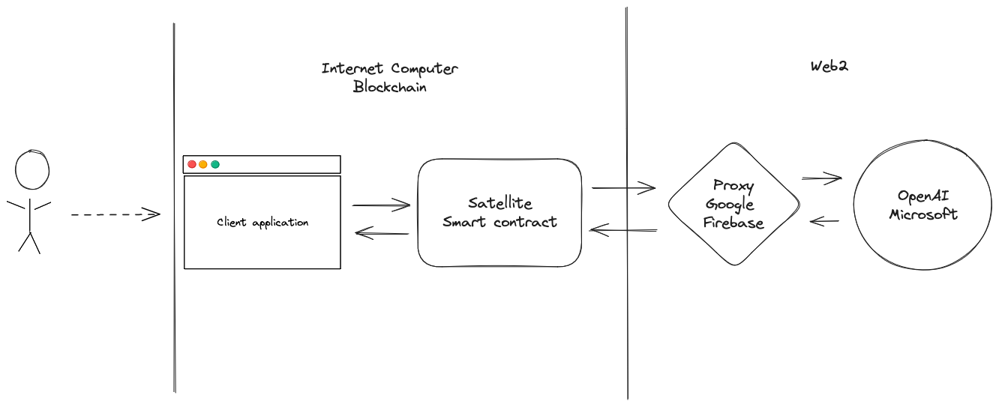
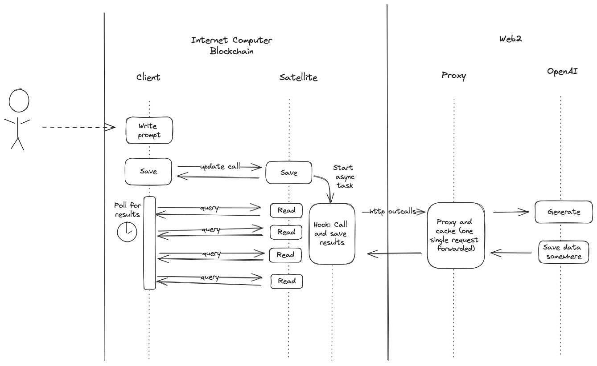

# Juno <> OpenAI

This demo showcases a straightforward integration of OpenAI's technologies, including DALL·E and the GPT-4 Vision Preview, into a decentralized application (dApp) using [Juno](https://juno.build)'s platform. It utilizes smart contracts to query OpenAI's models, leveraging the efficiency and scalability of Juno's serverless functions. This example illustrates how Juno's infrastructure can be used to incorporate AI capabilities into blockchain applications, providing a practical approach to accessing advanced AI features through smart contract operations.

## Notes

This sample is provided without much documentation. For any questions or further assistance, please feel free to reach out on our [Discord](https://discord.gg/wHZ57Z2RAG) channel.

## How does it work?

A browser-based application interacts with a Satellite, a smart contract, which prompts the OpenAI API through a proxy deployed on Google Firebase.

The client does not interact directly with nor request the generation of images but only saves prompts in the smart contract. This contract implements serverless functions triggered through hooks upon changes in the key store database or its file system.

These hooks take care of querying the proxy through HTTP outcalls. The proxy itself ensures that it forwards only one request to OpenAI per request and caches the answer. This way, the blockchain can query the proxy multiple times with a similar request and will receive an identical answer, which the replication can validate.

### Links & Resources

Here are some other useful links:

- Checkout [Juno](https://juno.build) for the easiest way to get started building on Web3.
- Have more questions, comments, or feedback? Feel free to open an issue or reach out on [X/Twitter](https://twitter.com/daviddalbusco).

## License

MIT © [David Dal Busco](mailto:david.dalbusco@outlook.com)
